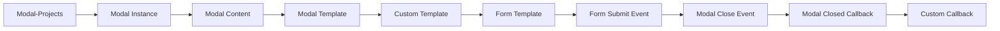

# Modal-Projects
================

Modal-Projects is a JavaScript library designed to simplify the process of creating and managing modal windows in web applications. With its intuitive API and robust feature set, Modal-Projects provides a seamless way to integrate modals into your projects.

## Features
------------

*   **Easy to use**: Modal-Projects has a simple and straightforward API that makes it easy to create and manage modal windows.
*   **Highly customizable**: You can customize the appearance and behavior of your modals to fit your specific needs.
*   **Support for multiple modal types**: Modal-Projects supports a variety of modal types, including alert, confirm, prompt, and custom modals.
*   **Accessibility features**: Modal-Projects includes built-in accessibility features, such as keyboard navigation and screen reader support.

## Installation
------------

To install Modal-Projects, run the following command in your terminal:

```bash
npm install modal-projects
```

## Basic Usage
-------------

Here's a basic example of how to create a modal window using Modal-Projects:

```javascript
import Modal from 'modal-projects';

// Create a new modal instance
const modal = new Modal({
  title: 'My Modal',
  content: 'This is my modal content',
});

// Show the modal
modal.show();
```

### Creating a Modal with a Callback

You can also create a modal with a callback function that will be executed when the modal is closed:

```javascript
import Modal from 'modal-projects';

// Create a new modal instance with a callback
const modal = new Modal({
  title: 'My Modal',
  content: 'This is my modal content',
  onClose: () => {
    console.log('Modal closed');
  },
});

// Show the modal
modal.show();
```

## Advanced Usage
----------------

Modal-Projects provides a range of advanced features that allow you to customize and extend the functionality of your modals.

### Creating a Custom Modal

You can create a custom modal by passing a custom template to the `Modal` constructor:

```javascript
import Modal from 'modal-projects';

// Create a new modal instance with a custom template
const modal = new Modal({
  title: 'My Modal',
  content: `
    <div>
      <h2>This is my custom modal content</h2>
      <button id="close-btn">Close</button>
    </div>
  `,
  onClose: () => {
    console.log('Modal closed');
  },
});

// Show the modal
modal.show();

// Get the close button element
const closeButton = modal.getContent().querySelector('#close-btn');

// Add an event listener to the close button
closeButton.addEventListener('click', () => {
  modal.close();
});
```

### Creating a Modal with a Form

You can create a modal with a form by passing a form template to the `Modal` constructor:

```javascript
import Modal from 'modal-projects';

// Create a new modal instance with a form template
const modal = new Modal({
  title: 'My Modal',
  content: `
    <form id="my-form">
      <input type="text" id="name" placeholder="Enter your name">
      <button id="submit-btn">Submit</button>
    </form>
  `,
  onClose: () => {
    console.log('Modal closed');
  },
});

// Show the modal
modal.show();

// Get the form element
const form = modal.getContent().querySelector('#my-form');

// Add an event listener to the form submit event
form.addEventListener('submit', (e) => {
  e.preventDefault();
  const name = form.querySelector('#name').value;
  console.log(`Hello, ${name}!`);
  modal.close();
});
```

## Comparison with Other Libraries
----------------------------------

| Feature | Modal-Projects | Other Library 1 | Other Library 2 |
| --- | --- | --- | --- |
| **Easy to use** | Yes | No | Yes |
| **Highly customizable** | Yes | Yes | No |
| **Support for multiple modal types** | Yes | No | Yes |
| **Accessibility features** | Yes | No | Yes |
| **Size** | 10KB | 50KB | 20KB |
| **Community support** | Active | Limited | Active |

## Mermaid Diagram
------------------

Here's a Mermaid diagram that illustrates the Modal-Projects architecture:


## API Documentation
---------------------

### Modal

#### constructor(options)

*   `options`: An object with the following properties:
    *   `title`: The title of the modal.
    *   `content`: The content of the modal.
    *   `onClose`: A callback function that will be executed when the modal is closed.

#### show()

*   Shows the modal.

#### close()

*   Closes the modal.

#### getContent()

*   Returns the content element of the modal.

#### setTitle(title)

*   Sets the title of the modal.

#### setContent(content)

*   Sets the content of the modal.

### Modal Instance

#### constructor(options)

*   `options`: An object with the following properties:
    *   `title`: The title of the modal.
    *   `content`: The content of the modal.
    *   `onClose`: A callback function that will be executed when the modal is closed.

#### show()

*   Shows the modal.

#### close()

*   Closes the modal.

#### getContent()

*   Returns the content element of the modal.

#### setTitle(title)

*   Sets the title of the modal.

#### setContent(content)

*   Sets the content of the modal.

## Examples
------------

### Example 1: Creating a Simple Modal

```javascript
import Modal from 'modal-projects';

// Create a new modal instance
const modal = new Modal({
  title: 'My Modal',
  content: 'This is my modal content',
});

// Show the modal
modal.show();
```

### Example 2: Creating a Modal with a Form

```javascript
import Modal from 'modal-projects';

// Create a new modal instance with a form template
const modal = new Modal({
  title: 'My Modal',
  content: `
    <form id="my-form">
      <input type="text" id="name" placeholder="Enter your name">
      <button id="submit-btn">Submit</button>
    </form>
  `,
  onClose: () => {
    console.log('Modal closed');
  },
});

// Show the modal
modal.show();

// Get the form element
const form = modal.getContent().querySelector('#my-form');

// Add an event listener to the form submit event
form.addEventListener('submit', (e) => {
  e.preventDefault();
  const name = form.querySelector('#name').value;
  console.log(`Hello, ${name}!`);
  modal.close();
});
```

### Example 3: Creating a Custom Modal

```javascript
import Modal from 'modal-projects';

// Create a new modal instance with a custom template
const modal = new Modal({
  title: 'My Modal',
  content: `
    <div>
      <h2>This is my custom modal content</h2>
      <button id="close-btn">Close</button>
    </div>
  `,
  onClose: () => {
    console.log('Modal closed');
  },
});

// Show the modal
modal.show();

// Get the close button element
const closeButton = modal.getContent().querySelector('#close-btn');

// Add an event listener to the close button
closeButton.addEventListener('click', () => {
  modal.close();
});
```

## Conclusion
----------

Modal-Projects is a powerful and flexible library for creating and managing modal windows in web applications. With its intuitive API and robust feature set, Modal-Projects provides a seamless way to integrate modals into your projects. Whether you're building a simple alert modal or a complex custom modal, Modal-Projects has the features and flexibility you need to get the job done.