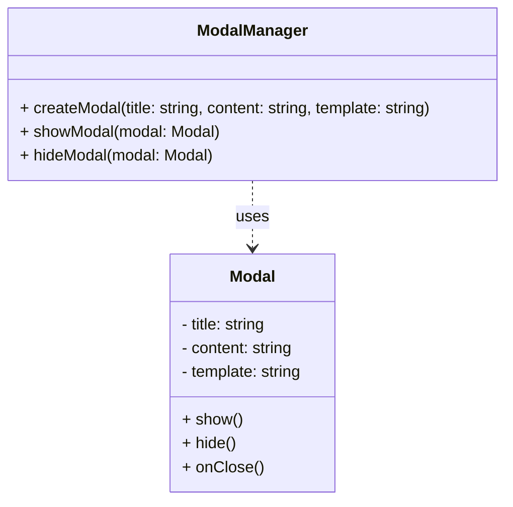

# Modal-Projects
================

Modal-Projects is a JavaScript library designed to simplify the process of creating and managing modal windows in web applications. With its intuitive API and robust feature set, Modal-Projects provides a seamless way to integrate modals into your projects.

## Features
------------

*   **Easy to use**: Modal-Projects has a simple and straightforward API that makes it easy to create and manage modal windows.
*   **Highly customizable**: You can customize the appearance and behavior of your modals to fit your specific needs.
*   **Support for multiple modal types**: Modal-Projects supports a variety of modal types, including alert, confirm, prompt, and custom modals.
*   **Accessibility features**: Modal-Projects includes built-in accessibility features, such as keyboard navigation and screen reader support.

## Comparison with Other Modal Libraries
----------------------------------------

| Feature | Modal-Projects | Other Library 1 | Other Library 2 |
| --- | --- | --- | --- |
| Ease of Use | Simple and straightforward API | Complex API | Steep learning curve |
| Customizability | Highly customizable | Limited customization options | Fully customizable |
| Modal Types | Supports multiple modal types | Limited to alert and confirm | Supports custom modals |
| Accessibility | Built-in accessibility features | Limited accessibility features | No accessibility features |

## Installation
------------

To install Modal-Projects, run the following command in your terminal:

```bash
npm install modal-projects
```

## Basic Usage
-------------

Here's a basic example of how to create a modal window using Modal-Projects:

```javascript
import Modal from 'modal-projects';

// Create a new modal instance
const modal = new Modal({
  title: 'My Modal',
  content: 'This is my modal content',
});

// Show the modal
modal.show();
```

### Creating a Modal with a Callback

You can also create a modal with a callback function that will be executed when the modal is closed:

```javascript
import Modal from 'modal-projects';

// Create a new modal instance with a callback
const modal = new Modal({
  title: 'My Modal',
  content: 'This is my modal content',
  onClose: () => {
    console.log('Modal closed');
  },
});

// Show the modal
modal.show();
```

### Creating a Modal with a Button

You can also create a modal with a button:

```javascript
import Modal from 'modal-projects';

// Create a new modal instance with a button
const modal = new Modal({
  title: 'My Modal',
  content: 'This is my modal content',
  buttons: [
    {
      text: 'OK',
      onClick: () => {
        console.log('OK button clicked');
      },
    },
    {
      text: 'Cancel',
      onClick: () => {
        console.log('Cancel button clicked');
      },
    },
  ],
});

// Show the modal
modal.show();
```

## Advanced Usage
----------------

Modal-Projects provides a range of advanced features that allow you to customize and extend the functionality of your modals.

### Creating a Custom Modal

You can create a custom modal by passing a custom template to the `Modal` constructor:

```javascript
import Modal from 'modal-projects';

// Create a new custom modal instance
const modal = new Modal({
  title: 'My Custom Modal',
  content: '<div>This is my custom modal content</div>',
  template: '<div class="custom-modal">{{content}}</div>',
});

// Show the modal
modal.show();
```

### Customizing Modal Styles

You can customize the styles of your modals by using CSS classes:

```javascript
import Modal from 'modal-projects';

// Create a new modal instance with custom styles
const modal = new Modal({
  title: 'My Modal',
  content: 'This is my modal content',
  className: 'my-modal',
});

// Show the modal
modal.show();
```

```css
.my-modal {
  background-color: #f0f0f0;
  border: 1px solid #ccc;
  padding: 20px;
}
```

### Integrating with Other Libraries

Modal-Projects can be integrated with other libraries and frameworks, such as React and Angular:

```javascript
import React from 'react';
import Modal from 'modal-projects';

// Create a new React component that uses Modal-Projects
const MyComponent = () => {
  const [showModal, setShowModal] = React.useState(false);

  const handleButtonClick = () => {
    setShowModal(true);
  };

  return (
    <div>
      <button onClick={handleButtonClick}>Show Modal</button>
      {showModal && (
        <Modal
          title="My Modal"
          content="This is my modal content"
          onClose={() => setShowModal(false)}
        />
      )}
    </div>
  );
};
```

## Architecture
--------------

The following Mermaid diagram illustrates the architecture of Modal-Projects:


## Accessibility
--------------

Modal-Projects includes built-in accessibility features, such as keyboard navigation and screen reader support. The following code example demonstrates how to use these features:

```javascript
import Modal from 'modal-projects';

// Create a new modal instance with accessibility features
const modal = new Modal({
  title: 'My Modal',
  content: 'This is my modal content',
  accessibility: {
    keyboardNavigation: true,
    screenReaderSupport: true,
  },
});

// Show the modal
modal.show();
```

## Best Practices
----------------

Here are some best practices to keep in mind when using Modal-Projects:

*   Use clear and concise titles and content for your modals.
*   Use accessibility features to ensure that your modals are accessible to all users.
*   Test your modals thoroughly to ensure that they work as expected.
*   Use custom templates and styles to customize the appearance and behavior of your modals.

## Troubleshooting
-----------------

Here are some common issues that you may encounter when using Modal-Projects, along with solutions:

*   **Modal not showing**: Check that you have called the `show()` method on the modal instance.
*   **Modal not closing**: Check that you have called the `hide()` method on the modal instance.
*   **Modal not accessible**: Check that you have enabled accessibility features for the modal instance.

## Conclusion
--------------

Modal-Projects is a powerful and flexible library for creating and managing modal windows in web applications. With its intuitive API and robust feature set, Modal-Projects provides a seamless way to integrate modals into your projects. By following the best practices and troubleshooting guides outlined in this documentation, you can ensure that your modals are effective and accessible to all users.